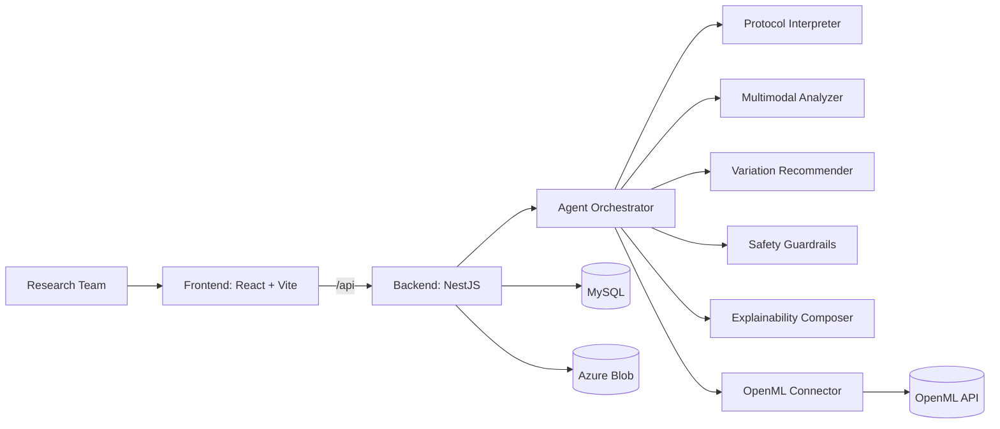
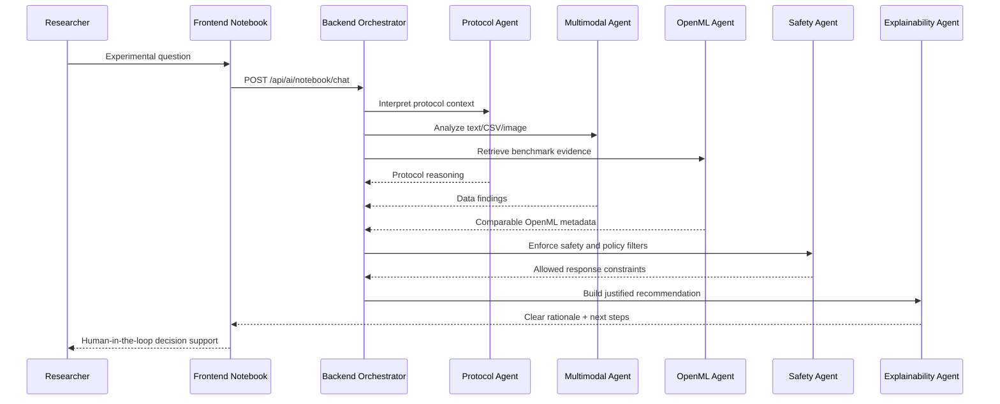

# Sapient Lab

### Lab Notebook AI Assistant

Plataforma para asistir a investigadores en el razonamiento experimental con agentes de IA,
sin reemplazar el juicio cientifico humano.

---

## Judge Quick Access

---

## Challenge Statement

Los investigadores quieren ayuda para razonar sobre experimentos sin reemplazar el juicio cientifico.
El sistema debe interpretar protocolos, sugerir variaciones para siguientes pasos,
analizar resultados desde texto, CSV o imagenes y explicar claramente por que recomienda cada accion.

La solucion debe aplicar limites de seguridad estrictos en dominios biologicos/clinicos,
filtrado de contenido y control de asesoramiento no permitido.

---

## What We Built

**Sapient Lab** integra una experiencia de cuaderno cientifico asistido por agentes con:

- interpretacion de protocolos experimentales,
- analisis multimodal (texto, CSV, imagen, voz),
- recomendaciones explicadas para siguientes pasos,
- controles de seguridad y filtrado,
- soporte de evidencia externa con OpenML.

---

## Architecture Overview

---

## AI Agent Interaction (Judge View)

---

## Technology Stack

| Layer | Technologies |
|---|---|
| Frontend | React 19, TypeScript, Vite, React Router, Framer Motion |
| Backend | NestJS, Node.js, TypeScript, class-validator |
| Data | MySQL, project context documents, experiment notes |
| AI Services | Azure OpenAI/Foundry, Azure Vision, Azure Speech, Azure Document Intelligence |
| External Benchmark | OpenML (`/api/openml/*`) |
| Storage | Azure Blob Storage |

---

## Project Repositories (Current Workspace)

- Frontend: [Frontend](../../Frontend)
- Backend: [back_end](../../back_end)
- API and technical docs: [back_end/data/Document](../../back_end/data/Document)

---

## Evaluation Alignment

| Criterion | Implementation Evidence |
|---|---|
| Explainability | Recomendaciones con justificacion visible en notebook y flujo de insercion limpia (`extract-insertable`). |
| Safe agent design | Capas de safety y filtrado para dominios sensibles; backend con endpoints de analisis de seguridad. |
| Data/model orchestration | Orquestacion de agentes + contexto de proyecto + documentos + OpenML. |
| Human-in-the-loop | El sistema asiste, no reemplaza; la decision final queda en el investigador. |

---

## Demo Material

- Slides: https://www.canva.com/design/DAHEuqnjrpc/6jHkQVtlXaC9SG2pfgArTg/edit?utm_content=DAHEuqnjrpc&utm_campaign=designshare&utm_medium=link2&utm_source=sharebutton
- Video: En preparacion

---

## Team

| Member | Role |
|---|---|
| Franco Mario Ayala Quispe | AI / Backend / Integration |
| Alex David Tola Julian | Frontend / UX / Product Flow |
| Jhamil Calixto Mamani Quea | Data / Validation / Testing |
| Alexander Jonathan Villarroel Torrico | Architecture / Platform / Delivery |

---

## Contact

Para evaluacion tecnica y walkthrough, usar Issues o Discussions en este espacio de trabajo.

