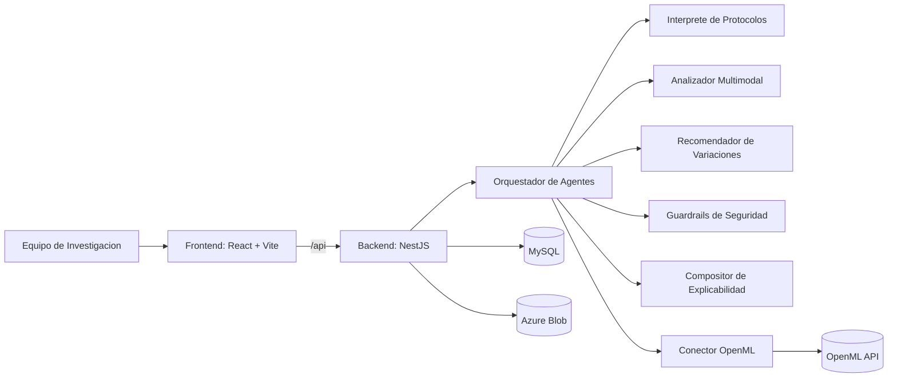
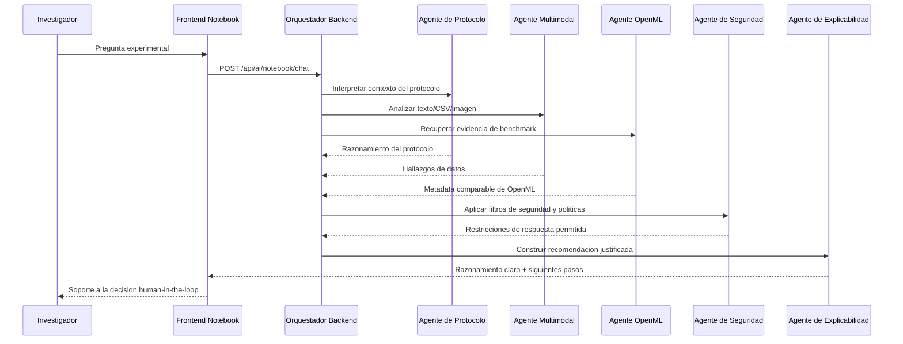

 

 

# Sapient Lab

### Lab Notebook AI Assistant

Plataforma para asistir a investigadores en el razonamiento experimental con agentes de IA,
sin reemplazar el juicio cientifico humano.

---

## Acceso Rapido para Jurados

---

## Descripcion del Proyecto

Sapient Lab es un asistente de cuaderno de laboratorio basado en agentes que ayuda a equipos de investigacion a interpretar protocolos,
analizar resultados experimentales y proponer siguientes pasos explicados, manteniendo seguridad estricta y control humano en la decision final.

El sistema integra analisis multimodal (texto, CSV, imagen y voz), evidencia externa con OpenML y una arquitectura de IA responsable
orientada a transparencia, trazabilidad y limites de uso en escenarios sensibles.

---

## Enunciado del Reto

Los investigadores quieren ayuda para razonar sobre experimentos sin reemplazar el juicio cientifico.
El sistema debe interpretar protocolos, sugerir variaciones para siguientes pasos,
analizar resultados desde texto, CSV o imagenes y explicar claramente por que recomienda cada accion.

La solucion debe aplicar limites de seguridad estrictos en dominios biologicos/clinicos,
filtrado de contenido y control de asesoramiento no permitido.

---

## Que Construimos

**Sapient Lab** integra una experiencia de cuaderno cientifico asistido por agentes con:

- interpretacion de protocolos experimentales,
- analisis multimodal (texto, CSV, imagen, voz),
- recomendaciones explicadas para siguientes pasos,
- controles de seguridad y filtrado,
- soporte de evidencia externa con OpenML.

---

## Arquitectura General

---

## Interaccion de Agentes de IA (Vista para Jurados)

---

## Stack Tecnologico

| Capa | Tecnologias |
|---|---|
| Frontend | React 19, TypeScript, Vite, React Router, Framer Motion |
| Backend | NestJS, Node.js, TypeScript, class-validator |
| Datos | MySQL, documentos de contexto de proyecto, notas de experimento |
| Servicios de IA | Azure OpenAI/Foundry, Azure Vision, Azure Speech, Azure Document Intelligence |
| Benchmark externo | OpenML (`/api/openml/*`) |
| Almacenamiento | Azure Blob Storage |

## Servicios de Azure en Uso

---

## Repositorios del Proyecto (Para Jurados)

- Frontend: https://github.com/Sapient-Lab/Frontend
- Backend: https://github.com/Sapient-Lab/back_end

---

## Matriz de Evaluacion para Jurados (Semana del 30 de marzo de 2026)

| Criterio | Ponderacion | Como lo cumple Sapient Lab |
|---|---:|---|
| Rendimiento | 25% | Arquitectura frontend/backend separada con APIs dedicadas para chat, analisis y notebook; flujo de insercion limpia reduce ruido y acelera trabajo de laboratorio; soporte de contexto por proyecto para respuestas mas relevantes. |
| Innovacion | 25% | Asistente de notebook cientifico con arquitectura multiagente, razonamiento explicable, analisis multimodal y enriquecimiento con OpenML para evidencia comparativa en recomendaciones. |
| Amplitud de los servicios de Azure utilizados | 25% | Uso combinado de Azure OpenAI, Azure AI Foundry, Azure Vision, Azure Speech, Azure Document Intelligence y Azure Blob Storage en un flujo unico orientado a investigacion. |
| IA responsable | 25% | Guardrails y filtrado para contenido sensible, limites para evitar asesoramiento no permitido, explicaciones transparentes y enfoque human-in-the-loop para no reemplazar el juicio cientifico. |

### Evidencia tecnica para jueces

- Agentes IA y notebook: endpoints `/api/ai/*` en backend.
- Seguridad: modulo safety (`/api/safety/analyze`) y politicas de filtrado.
- OpenML: endpoints `/api/openml/*` para datasets, tareas, runs y evaluaciones.
- Frontend de evaluacion: flujo `/app/lab`, `/app/protocolos`, `/app/docs`, `/app/equipo`.

---

## Material de Demo

- Slides: https://www.canva.com/design/DAHEuqnjrpc/6jHkQVtlXaC9SG2pfgArTg/edit?utm_content=DAHEuqnjrpc&utm_campaign=designshare&utm_medium=link2&utm_source=sharebutton
- Video: En preparacion

---

## Equipo

| Integrante | Rol |
|---|---|
| Franco Mario Ayala Quispe | AI / Backend / Integration |
| Alex David Tola Julian | Frontend / UX / Product Flow |
| Maya Celina Cadiz Quispe | Product / Research / Presentation |
| Jhamil Calixto Mamani Quea | Data / Validation / Testing |
| Alexander Jonathan Villarroel Torrico | Architecture / Platform / Delivery |

---

## Contacto

Para evaluacion tecnica y walkthrough, usar Issues o Discussions en este espacio de trabajo.

